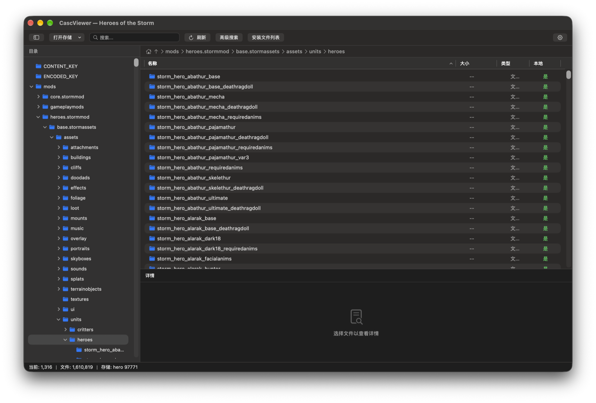
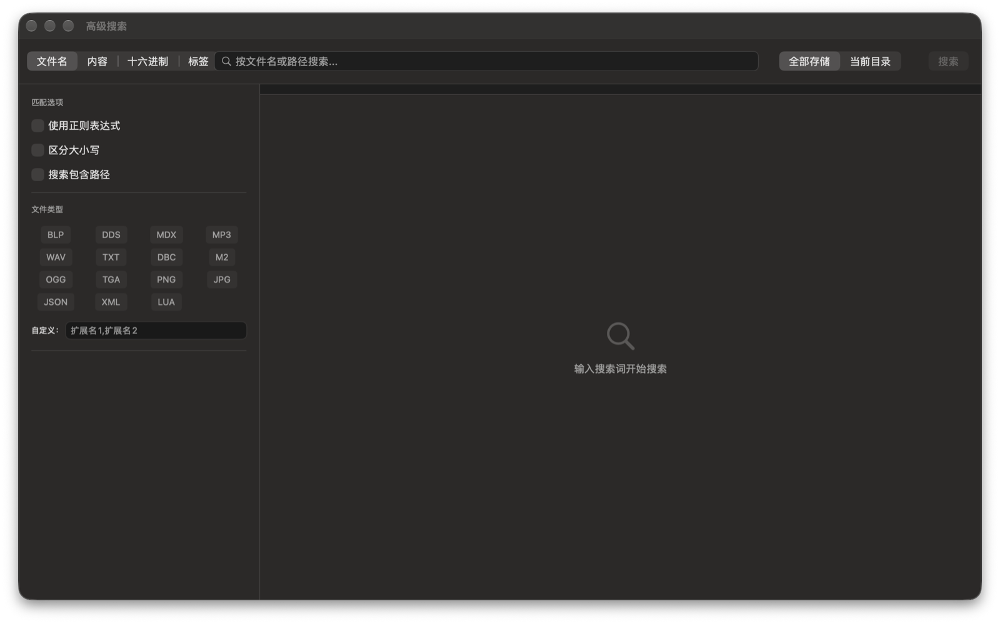
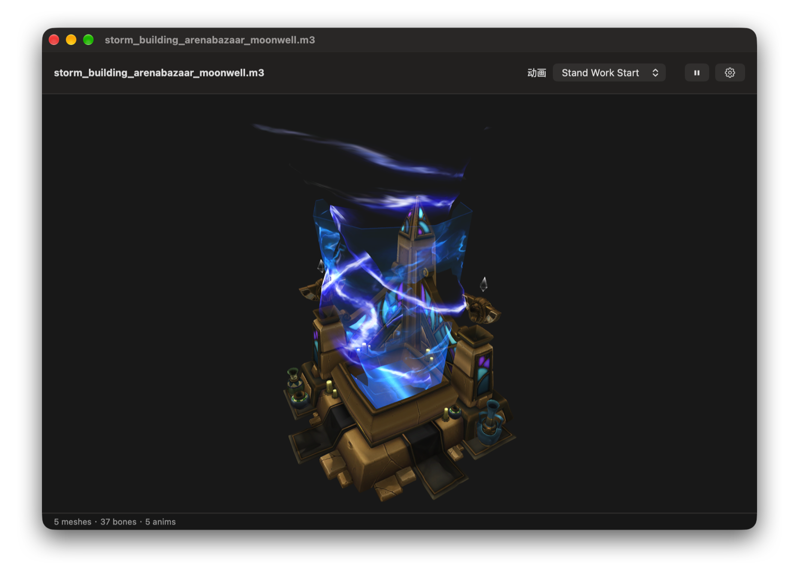

<h1 align="center">CascViewer</h1>

<p align="center">
  <strong>A native macOS application for browsing Blizzard CASC (Content Addressable Storage Container) file systems.</strong>
</p>

<p align="center">
  <a href="#requirements">
    
  </a>
  <a href="#building">
    
  </a>
  <a href="#building">
    
  </a>
  <a href="#license">
    
  </a>
</p>

<p align="center">
  English | <a href="README.zh.md">简体中文</a>
</p>

---

## 💡 Background

CascViewer was born out of a simple need: **there was no visual CASC browsing tool available for macOS**. While Windows users have had [CascView](https://www.zezula.net/en/casc/main.html) for years, macOS users who wanted to peek into Blizzard game assets were left with command-line tools or running Windows software through virtualization.

This project aims to fill that gap by bringing a native, modern macOS experience to CASC browsing. Feature design and workflow are heavily inspired by the Windows classic **CascView** by Ladislav Zezula, reimagined with SwiftUI and native macOS patterns.

<p align="center">
  
</p>

## ✨ Features

### Storage Browsing
- **Local Storage** — Browse CASC archives from installed Blizzard games
- **Online CDN Storage** — Connect directly to Blizzard CDN without local game installation, with automatic cache management
- **Listfile Support** — Load custom listfiles to resolve obfuscated filenames (`FILE########.dat` → human-readable names)
- **Directory Tree** — Hierarchical folder navigation with virtual folders for uncategorized files

### 3D Model Viewing
- **M3 Models** — Render M3 models with skeletal animation playback (SceneKit + SCNSkinner)
- **Animation Switching** — Pick any embedded sequence, including animations from companion `.m3a` files
- **Full Material Layers** — Diffuse, normal, specular and emissive maps with composite material support
- **Free Camera** — Drag to orbit, scroll to zoom, middle/right-drag to pan

### Advanced Search
- **Multi-mode Search** — Search by filename, content, hex pattern, or install manifest tag
- **Scope Selection** — Search entire storage or limit to current directory
- **Regex Support** — Enable regular expressions for complex patterns
- **File Type Filtering** — Filter by file extension or custom type patterns
- **Sortable Results** — Sort by name, size, or path with ascending/descending order

### File Operations
- **Extract Files** — Export single or multiple files with optional directory structure preservation
- **Progress Tracking** — Real-time extraction progress with cancel support
- **Path Copying** — Copy full file paths to clipboard

### Image Viewing
- **BLP Textures** — View BLP1/2 textures with MIP map level switching
- **DDS Textures** — View DDS textures with DXT1/3/5 decompression
- **Built-in Viewer** — Optional built-in viewer or external application opening

### Install Manifest
- **Manifest Browser** — Parse and view install manifest files, filter files by install tags (locale, platform, etc.)

### UI & Localization
- **Native macOS Design** — Classic three-pane layout with modern SwiftUI styling
- **Dark Mode Support** — Automatic light/dark theme following system preferences
- **Multi-language** — English and Simplified Chinese (简体中文) support
- **Resizable Panes** — Adjustable sidebar and file list/preview divider

## 🛠 Requirements

- **macOS** 13.0+ (Ventura or later)
- **Xcode** 15+
- **Swift** 5.9+
- **Git** (with submodule support)

## ⬇️ Download

Pre-built releases are available on the [Releases](https://github.com/Tlaeld/CascViewer/releases) page.

The app is **not signed with an Apple Developer certificate**. When launching a downloaded build, macOS may warn that the app "cannot be opened" or "is from an unidentified developer". To remove the quarantine attribute:

```bash
sudo xattr -r -d com.apple.quarantine /Applications/CascViewer.app
```

## 🚀 Building

### Clone and prepare

```bash
git clone --recursive https://github.com/Tlaeld/CascViewer.git
cd CascViewer
tools/build_whiteout.sh   # builds the WhiteoutLib static library (first time only)
```

The `--recursive` flag fetches the [CascLib](https://github.com/ladislav-zezula/CascLib) and [WhiteoutLib](https://github.com/FernandoS27/WhiteoutLib) submodules. If you already cloned without it, run `git submodule update --init --recursive` first.

### Build with Xcode

```bash
open CascViewer.xcodeproj
```

Then select **Product → Build** (⌘B) in Xcode.

### Build from command line

```bash
xcodebuild -project CascViewer.xcodeproj -scheme CascViewer -destination 'platform=macOS'
```

## 📖 Usage

### Opening a Storage

1. Click **"Open Storage"** in the toolbar
2. Choose one of:
   - **Local Folder** — Select a local CASC directory (e.g., `World of Warcraft\_retail_`)
   - **Online CDN** — Select a game product and region to browse via CDN

### Browsing Files

- Navigate using the **directory tree** on the left
- View files in the **file list** (center) with columns for name, path, size, type, and local availability
- Preview file details in the **info panel** (bottom)
- Double-click folders to navigate into them

### Searching

<p align="center">
  
</p>

1. Type in the toolbar search box for quick filename search
2. Or click **"Advanced Search"** to open the search panel with:
   - Filename / content / hex / tag search modes
   - Regex, case sensitivity, and path inclusion options
   - File type filters and scope selection

### Viewing 3D Models

<p align="center">
  
</p>

1. Select an `.m3` file and click **"Open in Model Viewer"** in the info panel
2. Drag to orbit around the model, scroll to zoom, middle/right-drag to pan
3. Use the animation menu in the title bar to switch animation sequences

### Extracting Files

1. Select one or more files in the file list
2. Right-click and choose **"Extract"**
3. Choose destination folder and options (preserve structure, overwrite)

### Viewing Images

- Double-click `.blp` or `.dds` files to open the image viewer
- Use MIP map selector to view different texture resolutions

### Keyboard Shortcuts

| Shortcut | Action |
|----------|--------|
| `⌘O` | Open Storage |
| `⌘R` | Refresh Current Storage |
| `⌘⇧F` | Advanced Search |
| `⌘⌥I` | Open Install Manifest |
| `⌘[` | Navigate Back |

## 🏗 Architecture

```
┌─────────────────────────────────────────────────┐
│                  SwiftUI Views                  │
├─────────────────────────────────────────────────┤
│  Swift Services (Storage, Search, Extract,      │
│  ModelLoader, ModelSceneBuilder, AnimationPlayer)│
├──────────────────────┬──────────────────────────┤
│  C++ Bridge (CascLib)│  WhiteoutBridge          │
├──────────────────────┼──────────────────────────┤
│  CascLib + CDN Cache │  WhiteoutLib (textures + │
│                      │  models, static lib)     │
└──────────────────────┴──────────────────────────┘
```

### Key Components

- **C++ Bridge Layer (CascLib)** — Wraps [CascLib](https://github.com/ladislav-zezula/CascLib) with a unified `ICascStorage` interface supporting both local and online storage; CASC storage access remains powered by CascLib
- **WhiteoutBridge** — C++ bridge to [WhiteoutLib](https://github.com/FernandoS27/WhiteoutLib) (git submodule, built with CMake via `tools/build_whiteout.sh` as a static library), providing BLP/DDS texture decoding and MDX/M3/M2 model parsing
- **Swift Service Layer** — Business logic for storage, search, extraction, image decoding, and model loading (`ModelLoaderService`, `ModelSceneBuilder`, `ModelAnimationPlayer`)
- **SwiftUI Frontend** — Native macOS UI with three-pane layout, supporting both SwiftUI and AppKit interop for advanced table views, plus a 3D model viewer with skeletal animation playback (SceneKit + SCNSkinner)

## 🤝 Contributing

Contributions are welcome! Please feel free to submit issues or pull requests.

1. Fork the repository
2. Create your feature branch (`git checkout -b feature/amazing-feature`)
3. Commit your changes (`git commit -m 'feat: add amazing feature'`)
4. Push to the branch (`git push origin feature/amazing-feature`)
5. Open a Pull Request

## 📄 License

This project is released under the **MIT License**.

The project uses [CascLib](https://github.com/ladislav-zezula/CascLib) by Ladislav Zezula, which is also licensed under the MIT License.

## 🙏 Acknowledgments

- **[CascLib](https://github.com/ladislav-zezula/CascLib)** by Ladislav Zezula — The CASC archive library that powers this application
- **[CascView](https://www.zezula.net/en/casc/main.html)** by Ladislav Zezula — The original Windows CASC browser that inspired this project's feature set and workflow
- **Blizzard Entertainment** — For the CASC file system specification

## ⚠️ Disclaimer

This is a **read-only browsing tool**. It does not modify Blizzard game files in any way. All game assets accessed through this tool remain the property of their respective copyright holders.

## 🤖 About the Code

This project was built with **vibe coding** — AI-assisted development using [Kimi](https://kimi.moonshot.cn/). While every effort has been made to ensure quality, you may encounter bugs or rough edges typical of AI-generated code. We appreciate your understanding and patience, and warmly welcome bug reports and contributions to help improve the project.
